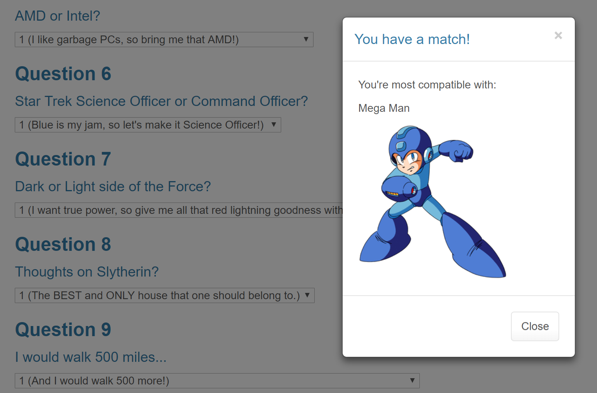

# Friend Finder

https://kilcannon.github.io/friend-finder/
- - - - - - - - - - - - - -
https://damp-falls-31424.herokuapp.com/

### Welcome to my super awesome Friend Finder Express App!

This app gives you the ability to match yourself with a potential friend, depending on your responses to questions.

Technology includes:
+ Javascript
+ NodeJS
+ NPM
+ Heroku
+ Express
+ HTML
+ CSS

Theme: Keepin' it thirsty with Node-tastic friend finding!

### Current features include:

+ Ability to take a 10 question survey
+ Responses are tabulated and compared to an object filled with pre-determined character types
+ Responses are given wtih modal pop-up that shows whom the user was matched with
+ Error handling for insufficient filling out of form data
+ Hosted on Heroku for easier consumption

### Features to come:
+ Change the layout to better differentiate it from stock formatting supplied from samples

### Image Captures of App Functioning
Sample Output View 

### Feedback is always appreciated!